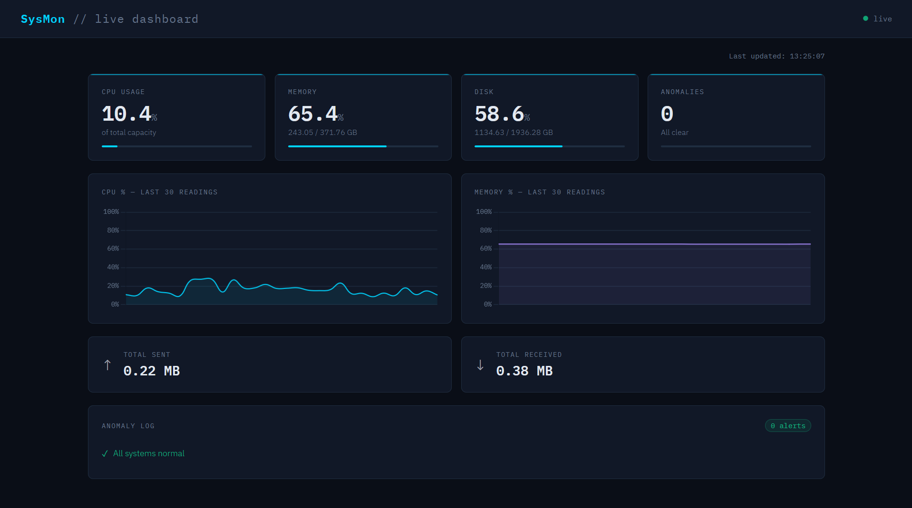

# SysMon, Live System Monitor

A real-time system monitoring dashboard built with FastAPI and Python. Tracks CPU, memory, disk, and network metrics from a live server, detects anomalies, and logs alerts to a persistent database.

**[Click for Live Demo!](https://web-production-b04c8.up.railway.app/)**



---

## What it does

- Polls live server metrics every 2 seconds via a REST API
- Renders a real-time dashboard with Chart.js, CPU and memory history charts, stat cards, and a network panel
- Detects anomalies (CPU spikes, memory pressure, disk saturation) using threshold-based rules
- Persists all flagged alerts to a SQLite database via SQLAlchemy so they survive server restarts
- Deployed on Railway, metrics reflect the cloud host, not a local machine

---

## Tech stack

| Layer          | Technology           |
| -------------- | -------------------- |
| Backend        | Python, FastAPI      |
| System metrics | psutil               |
| Database       | SQLite + SQLAlchemy  |
| Frontend       | Vanilla JS, Chart.js |
| Deployment     | Railway              |

---

## To Run locally:

```bash
# Clone the repo
git clone https://github.com/yourusername/system-monitor
cd system-monitor

# Set up virtual environment
python -m venv venv
source venv/bin/activate  # Windows: venv\Scripts\activate

# Install dependencies
pip install -r requirements.txt

# Start the server
uvicorn main:app --reload
```

Open `http://localhost:8000` to see the dashboard.

---

## API endpoints

| Endpoint           | Description                                          |
| ------------------ | ---------------------------------------------------- |
| `GET /api/metrics` | Returns current CPU, memory, disk, and network stats |
| `GET /api/alerts`  | Returns all logged anomaly alerts from the database  |

---

## Project structure

```
system-monitor/
├── main.py          # FastAPI app — API routes, metrics collection, anomaly detection
├── static/
│   └── index.html   # Frontend dashboard
├── requirements.txt
├── Procfile         # Railway deployment config
└── monitor.db       # SQLite database
```

---

## What I learned

- How REST APIs work in practice, building endpoints and using them on the frontend
- The difference between local and cloud environments (psutil reads the host it runs on, so deployed metrics reflect the Railway server, not my machine)
- How to persist data with SQLAlchemy and SQLite
- Deploying a Python web app to a cloud platform
